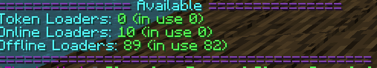

## Chunk Loaders

Modded Chunk Loaders have been disabled on ShadowNode servers globally, therefore we have added a plugin known as Better Chunk  Loaders to achieve their purpose. There are two types of Chunk Loaders, Always On and Online Only. To view chunk borders, hit ``F3+g``

### Always On vs Online Only

Always On is a chunk loader which is online 24/7 and will keep the chunk loaded. However, the chunk loader will stop loading the chunk after 3 days of activity. Once the owner returns, it will resume loading the chunk.The Online Only chunk loader will only load the chunk when the owner of the loader is online.

### 1.16 Chunkloaders

#### Checking your Balance

To check the number of chunks you have and may use on 1.16 servers you can run the following command to see your current chunkloaders `/ificlt balance`

#### Creating Chunkloaders

To create a chunkloader in 1.16 servers you will now need a physical block to do so as well as a blaze rod. The block that you need depends on the type of loader you have. The following blocks are used for the following type of loaders by default:

* Always Online - Diamond Block
* Online Only - Gold Block

{}

Please note that these blocks can change per pack. You can also view the current blocks for your pack by typing `/ificlt info`.

{}

Once you place the correct block in the chunk you wish to load (or radius load) you need to right click it with a Blaze Rod. If you have enough free chunk loaders you can create a radius chunk loader by right clicking the chunk loader block again. Please note that you can only assign a radius up to the maximum amount of chunk loaders you have and not larger than a radius of 4 per chunk loader. Once you are happy with your chunk loader set up shift-right click it to activate the loader. 

You can shift-right click one of your own loaders to disable it as well.

{}
If you need to break a chunk loader to move it or want the resources back you need to first shift-right click the chunk loader block with a blaze rod. Doing so will show that you have disabled the loader and it's been returned to your balance. Doing so will also delete the chunk loader so you will no longer have it loaded!.
{}

#### Showing Loaded Chunks

You can see the loaded chunks by right clicking on the loader with a peice of glow stone dust. This will create an effect that looks like a world border going out from the loader block and creating a square box of loaded chunks going out. This is super helpful with knowing what all you have loaded on radius loaders.

### 1.10 And 1.12 Chunkloaders

The most basic command in the plugin is ``/betterchunkloader``, or just ``/bcl`` for short. Executing this command will open an interface in the chat that the user may interact with. The interface will contain a list of active chunk loaders you currently own, along with some user-friendly icons. An example of the interface is below.

#### Checking Your Balance

To check the number of chunks you may use/have used, you can click the ``Balance`` or run ``/bcl bal``. The interface will state the number of both Always Online and Online Only chunks that are currently active (used) and are available.

#### How to Create Chunk Loaders

From the main interface, you should click the ``Create`` icon or run ``/bcl create`` to begin the process of creating a Chunk Loader. An interface will open and should look like the following image.

The interface will state the name of the chunk loader Owner. It will also give you the coordinates of the chunk that you are currently standing in. Please note that these coordinates are different than regular XYZ coordinates. To create an Always Online chunk loader or Online Only chunk loader, click their respective icons. You should be prompted with the following interface.

The ``Radius`` icons will determine the size of the chunk loader. You can only load as many chunks as your balance allows. Hovering over the icon will display how many chunks will be loaded with each radius upgrade.

After you select your radius size, your chunk loader will be created. You will be shown a confirmation window which will display your name, loader id, and state. If you'd like to delete your loader and regain your chunk balance, click the ``Delete`` icon.

#### How to View Active Chunk Loaders

Once you have Chunk Loaders active, running ``/bcl`` will contain some information regarding regarding your active chunk loaders. You can hover over the ``Chunk`` icon to view the coordinates of the chunk loader. Clicking ``View`` will pull up the same prompt that was displayed after you created your loader originally.

### How to Read Chunk Coordinates

To view the coordinates of the chunk you are currently in, press ``F3``. You will see the typical statistics of your game, which should resemble the image below. The value in the red box is your chunk coordinates.

