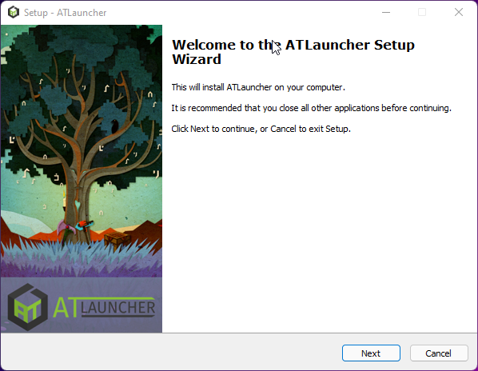
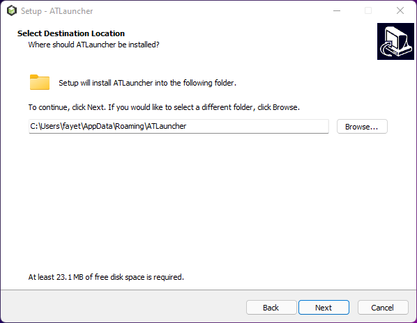
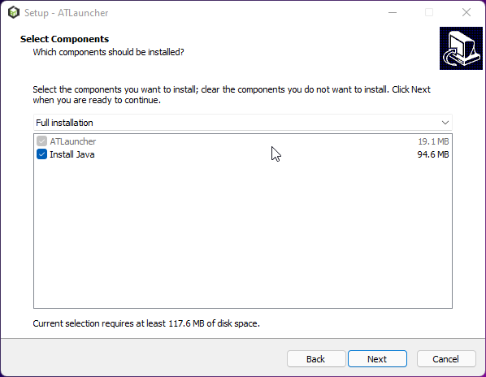

## About ATLauncher

### How to Install
1. Head to [ATLauncher](https://atlauncher.com/downloads) and select which software is most appropriate for you. Typically for Windows you want to click the "Setup (Recommended)" button.

Once you've opened the downloaded file please follow these directons. Please note that they were written on a Windows Machine and may differ depending on you Windows version or OS.

1. Click next

2. Accept the license agreement, click next. 

3. Choose your install directory and click next.

4. Make sure "Install Java" is checked. Click next and then on the next screen click next again. Finally click Install.

5. Disable Analytics by unchecking the box and click Save

### Adding a Modpack

Now that ATLauncher is installed you likely want to install a modpack to get playing on our modded network. To get started simply follow the directions below.

1. Click Packs and then type the name of the pack you want to install in the top search bar. I'll be using "SkyFactory 4".

2. On the search result page click "New Instance" and then you'll be prompted by a popup. In this window select the version you wish to install.

3. Once the install completes you'll be able to play by clicking "Instances" on the right hand bar then clicking Play for the pack in question.