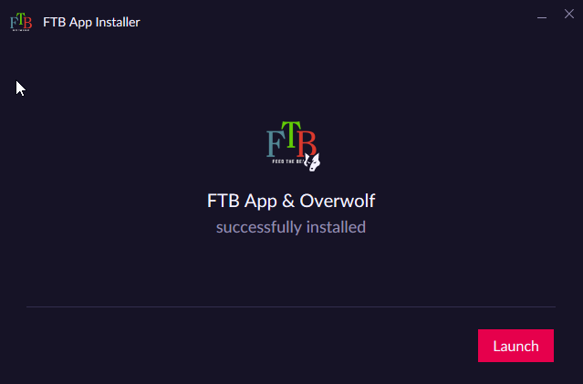
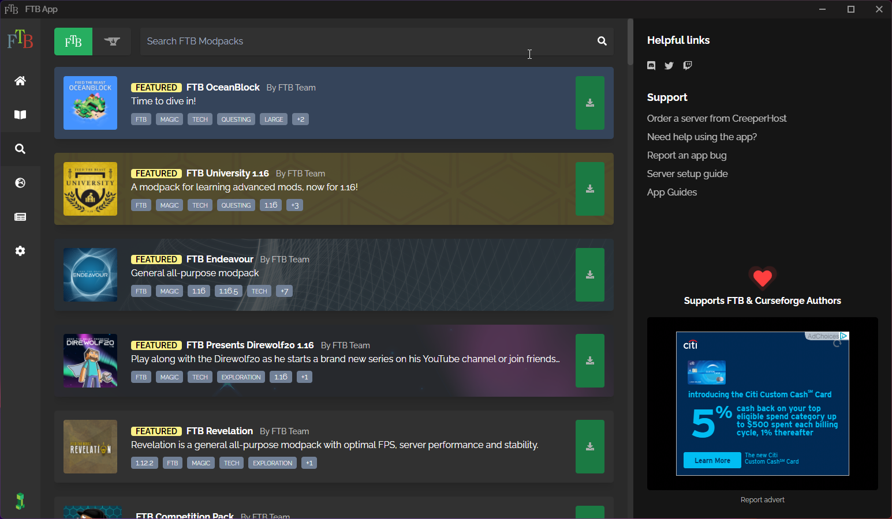
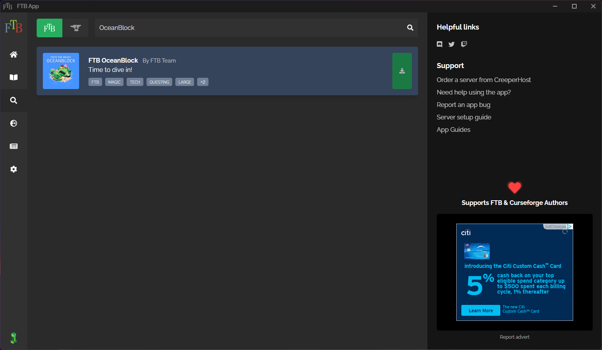
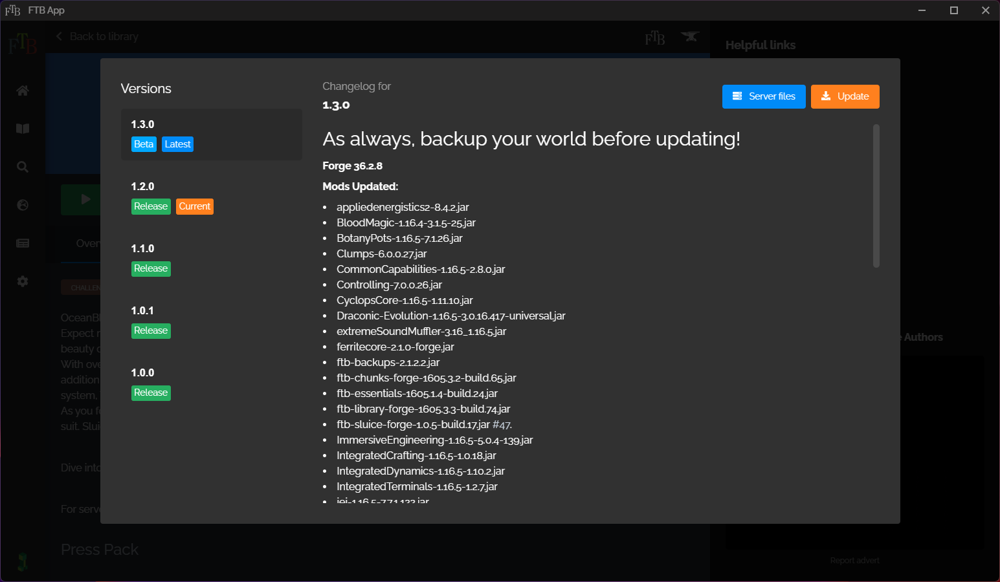

## About FTB App

FTB App is a popular Minecraft launcher brought to you by the Feed The Beast Team. It can be used to launch vanilla Minecraft, Feed The Beast (FTB), or CurseForge modpacks. This launcher great for getting into modded Minecraft and providing a simple expirence. However, for advanced users we'd recommend using GDLauncher or MultiMC. FTB App works on Windows, Linux and macOS.

### How to Install
Head to [Feed The Beast](https://feed-the-beast.com/app) and click on the download link for your platform. All instructions below assume you're running Windows.

Once you've downloaded the launcher  go to your downloads folder and open the installer and follow the instructions below to get setup.

1. Click next on this screen after selecting your language.
 
2. Read and accept the agreements. Click Next and let the launcher install.
 
3. Click Launch and then proceed to add a modpack.
 

{}
You may get the screen below when launching for the first time. It's recommended to accept the migration.
{}
 

### Adding a Modpack
When you launch into FTB App you will be greeted with a simple interface that will show you featured Modpacks. This interface will likely look somewhat familiar if you've used the CurseForge beta launcher as they are similiar.

There's a few options to install modpacks with the simplest being to search directly for the pack.

1. Click the search icon on the left hand side of the window.
 
2. This will take you to a new window that looks like the following. Please type the name of the modpack you're looking to install in the search bar at the top. We'll use OceanBlock in this example.
 
3. Click the green download icon on the right hand side of the modpack search results.
 
4. While referring to the pack version that we are currently using, look for it in the drop down list. You might need to check "Show Beta and Alpha versions" to find it. Click Install to install.
 
5. Once the modpack has finished installing you should now see a clickable green "View Instance" button in the bottom left. You will need to click it to be brought to the modpack screen.
 
6. You should be finally looking at the screen that looks l ike this. You can click play to launch your pack.

### Updating Modpacks
Time to time pack authors will release updates to packs and prompt us to update our servers as a result. When this happens you will also need to update your pack version to be able to connect. Luckily with FTB App this is simple to do.

1. Make sure you're on this page and then click "Versions"

2. Click on the version you would like to install, for example 1.3.0 then click the orange update button.

3. The modpack will now be preforming an update that looks / behaves very much like an install would normally. Once this process is done you'll have a green "View Instance"  button to click and then you're able to play the updated pack.

### Backup Modpacks with FTB App

At the time of writing there's currently no way to backup modpacks on this launcher through the app.