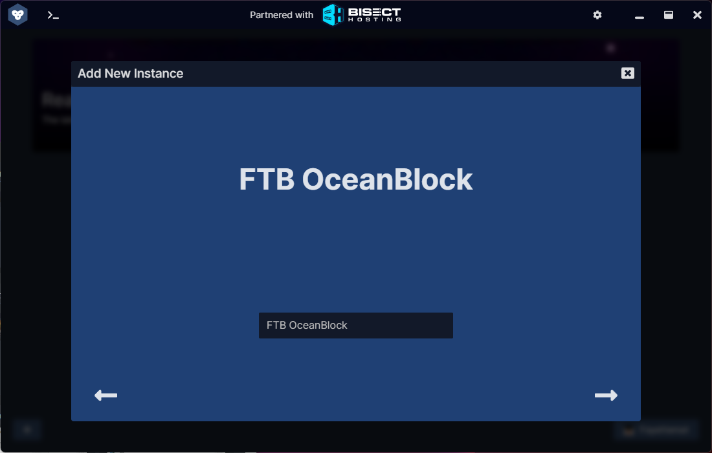
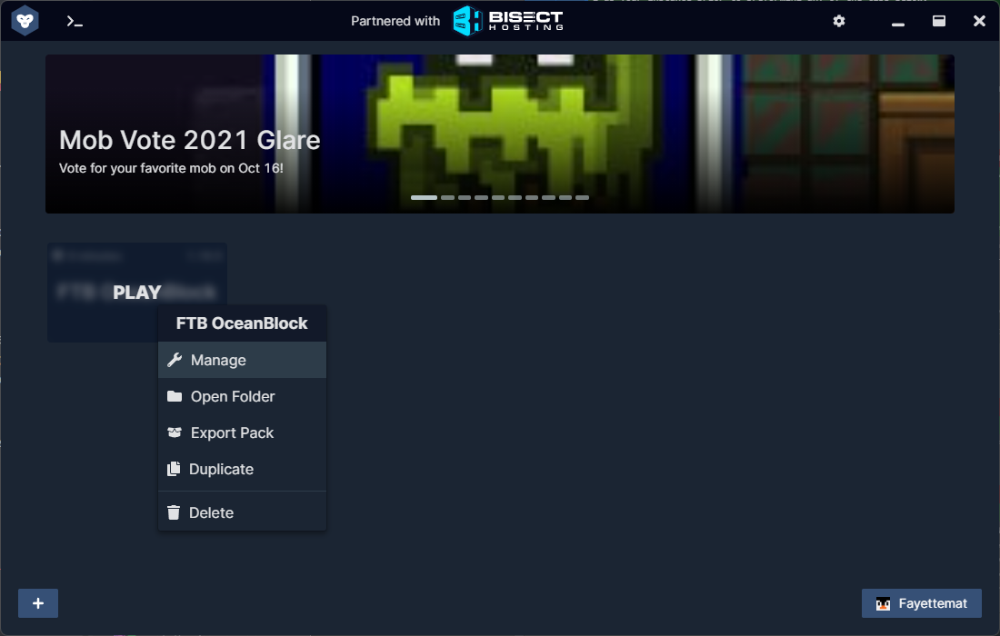
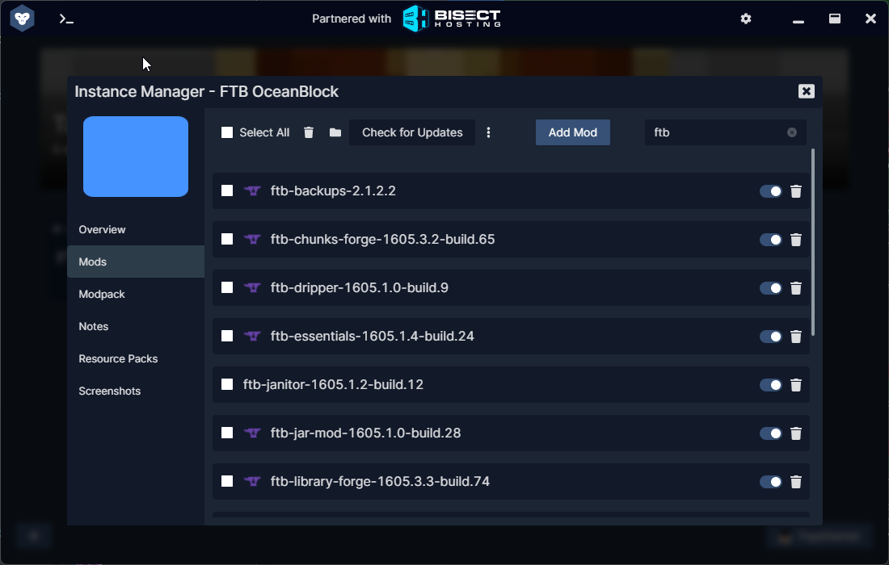
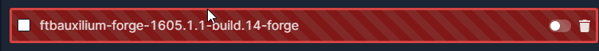
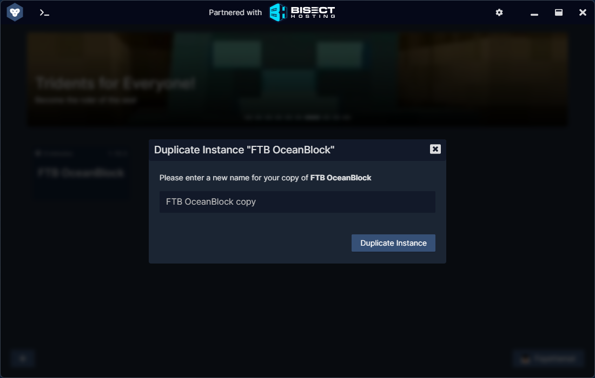

## About GDLauncher

GDLauncher is a Minecraft launcher. It can be used to launch vanilla Minecraft, custom modpacks, or regular modpacks. This launcher is one of our recommended options for installing modpacks and managing mods. GDLauncher works on all major platforms - Windows, Linux and macOS.

### How to Install
1. Head to [GDevs](https://gdevs.io) and select which software is most appropriate for you. Typically you want to click the "Download Now!" button.
2. Click the download link related to your OS and then save it to your Downloads folder for easy access.
3. Click the downloaded installer link and it will prompt you to install Java 8 and Java 16. This should be done automatically by the launcher with no intervention needed on your part. 
4. Next it should ask you to login to your Minecraft or Microsoft account. Please do so now.
5. After this process is done you should be greeted by a mostly blank window telling you no instance has been installed. See below for more details on adding mod packs.

### Adding a Modpack
1. Click the + button in GDLaunchers Main Window. 

2. Click the type of instance you like. If you're looking to install general Minecraft you're looking for Vanilla otherwise you're likely looking for CurseForge or FTB. If you're using a FTB Pack please click the FTB Tab.

3. Click the search box and type in the name of the pack that you're looking for. In the example below I've used OceanBlock.

3. Hover over the modpacks name and you will see an option to download latest or Explore / Versions. Click the Explore / Versions Option.

4. Now you will need to select your version of the modpack to begin the install. After this is done click Download.

5. Give your modpack download / instance a name. Click the next arrow.

6. Your modpack will now download. If you have issues with downloading Forge you might need to switch to the beta channel.
7. Click "Play" after hovering over the modpacks name and it will launch the pack. Enjoy!

### Managing Mods with GDLauncher
{}
Removing and adding mods can cause pack instablity. Please consult your launcher's documentation on backing up your instance prior to preforming any of the tips below.
{}

Using GDLauncher is almost as easy as MultiMC but this will likely get even easier in the future. The current hardships is that you have to enable the beta channel for GDLauncher to get it work correctly at this time. Please follow the steps below if you'd like to manage your mods with GDLauncher.

1. Right Click on the modpack and select `Manage`.
 
2. Click `Mods`

3. In the top right of the current window you'll see a search box. Type in the first part of the name of the mod you wish to remove. For example FTB Auxilium you would type in `FTB`.

4. Click the toggle for the mod you'd like to disable. It should look like the below once you've completed this.

5. Repeat Steps 3 and 4 for any mods you'd like to disable.
6. Click the X at the top of the window titled `Instance Manager`
7. Launch your modpack to play.

### Backup Modpacks with GDLauncher
If you're wanting to modify the mods in your pack it's highly recommend you backup your instance first. This prevents you from having to do a completely clean reinstall.

1. Right click on your modpack and select "Duplicate"
 
2. Enter a name for the duplicated modpack and press the duplicate button.
