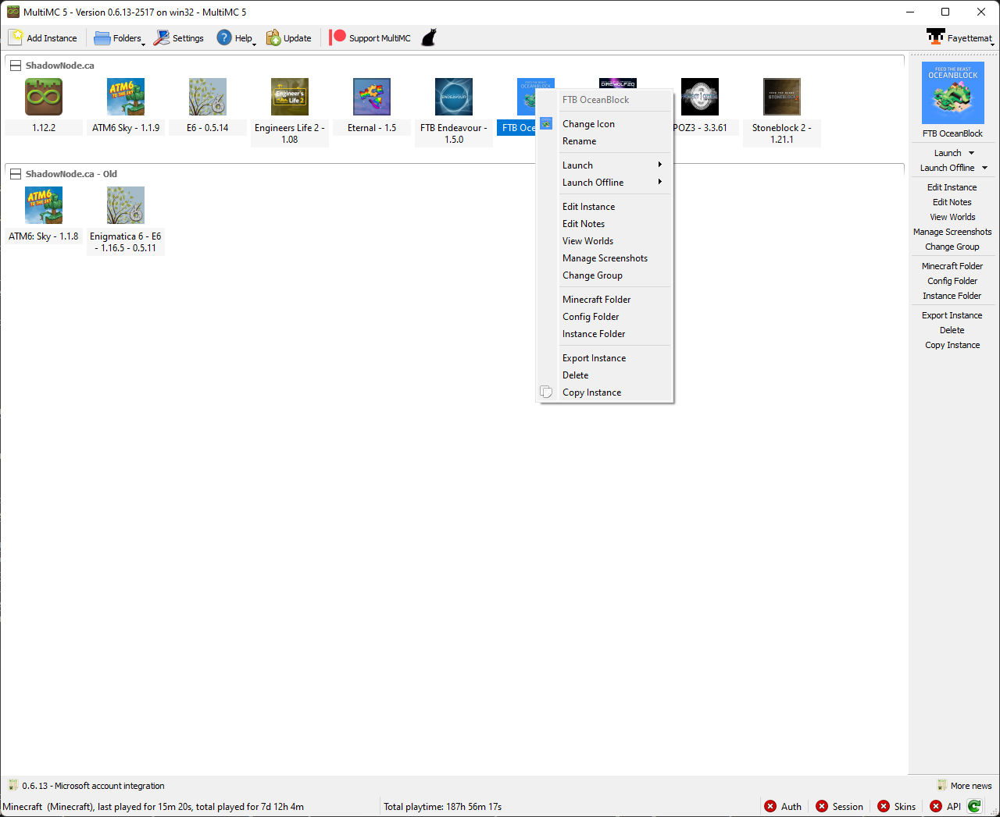
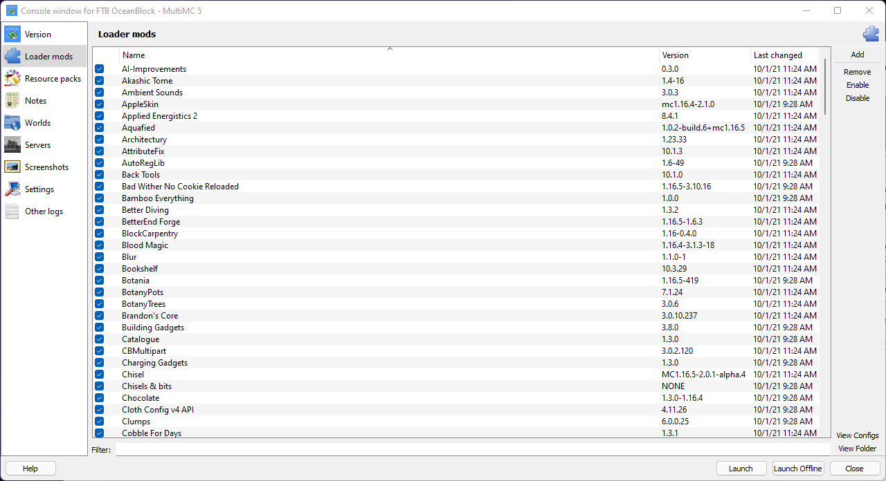

## About MultiMC

MultiMC is a Minecraft launcher. It can be used to launch vanilla Minecraft, custom modpacks, or regular modpacks. The launcher is very good for Linux users or those who don't like the Twitch Launcher. **We strongly recommend this launcher.**

### How to Install

  {}
  Please note that you should not attempt to run the program from within the zip file. You will need to extract it first.
  {}

1. Head to [MultiMC](https://multimc.org) and select which software is most appropriate for you.
2. Locate the downloaded zip file and extract it into a folder.
  - On most machines, you can right click the folder, click extract files and select your destination. If your machine does not have this option, head to Google!
  - As an example on Windows 10 you can right click and select "Extract All.." and select a destination to extract the files to.
  - We recommend only using the systems built in tools to extract compressed files.

3. Open the MultiMC folder generated at the location specified during extract and double click the MultiMC executable.
4. Complete the final setup details that it asks for, such as your preferred language and java version.

### Login to your Profile
1. Click Profiles at the top
2. Click Manage Accounts in the dropdown
3. Click Add on the right side and fill out the request information

### Allocate More Ram
*This must be done before setting up an instance*
1. Click the settings, found at the top of your toolbar
2. Head to Java on the left side
3. Under the memory section you will be able to change your minimum and maximum allocation
  - We do not suggest going above 8192mb
  - 6144mb is the average selection for 1.12+

### Setup an Instance
### With Link
1. Copy the link address from the modpack download page
2. In MultiMC, select the white blank paper at the top that says Add Instance
3. Check the box next to Import Modpack (local file or link)
4. Paste your link into the text box below
5. Enter the name of the modpack
6. Click on the instance and launch

**To update you must reinstall the new update in the same manor as you downloaded the pack oringinally. Remember to save any world files for single player worlds.**
### With Zip
1. Download a zip file of the modpack from the modpack download page
2. In MultiMC, select the white blank paper at the top that says Add Instance
3. Check the box next to Import Modpack (local file or link)
4. Click the 3 dots and locate your zip
5. Once located, click ok
6. Launch and enjoy

### Archive Cannot find instance.cfg
Ensure that you are running a version higher than or equal to 0.6.0. You can find your version at the top of the launcher toolbar. If your version is not higher than or equal to 0.6.0, follow [this tutorial](https://github.com/MultiMC/MultiMC5/wiki/Switching-update-channels)

### Adding Java Arguments
1. Locate the Settings tab at the top of the toolbar
2. Click Java on the left side
3. Locate JVM Arguments in the Java Runtime section
4. Fill in your desired arguments in the blank
5. Click test to verify everything is working properly.

### Managing Mods With MultiMC
{}
Removing and adding mods can cause pack instablity. Please consult your launcher's documentation on backing up your instance prior to preforming any of the tips below.
{}

Using [MultiMC](https://multimc.org/) is by far the easiest and simplest method for updating and managing your mods. 

Below is an example of how to remove/disable a mod with MultiMC. In the below example we will be removing `FTB Auxilium`.
`
1. Right Click on the modpack and select `Edit Instance` from the menu that pops up.
 
2. On the left hand of the window you will see a list of icons and options. Click `Loader Mods`.
 
3. At the bottom of this new section there's a text box that is labeled filter type in the first part of name of the mod you wish to disable. For example to disable FTB Auxiium you would type in `FTB`. You should then see only one mod listed. Uncheck the check box for this mod.
 
4. Repeat for any other mods you neeed to remove.
5. Click "Close" when done.
6. Launch your modpack to play.

### Backing up your modpacks
If you're wanting to modify the mods in your pack it's highly recommend you backup your instance first. This prevents you from having to do a completely clean reinstall.

1. Select your modpack and right click it. Select copy instance.
 
2. Type a new name for the copied modpack in and click ok. Optionally you can also copy your saves and keep your play time. This is great if you want to try out a mod or two that you have a feeling will break your pack.
 
3. You will now have a duplicate modpack ready for backup purposes.