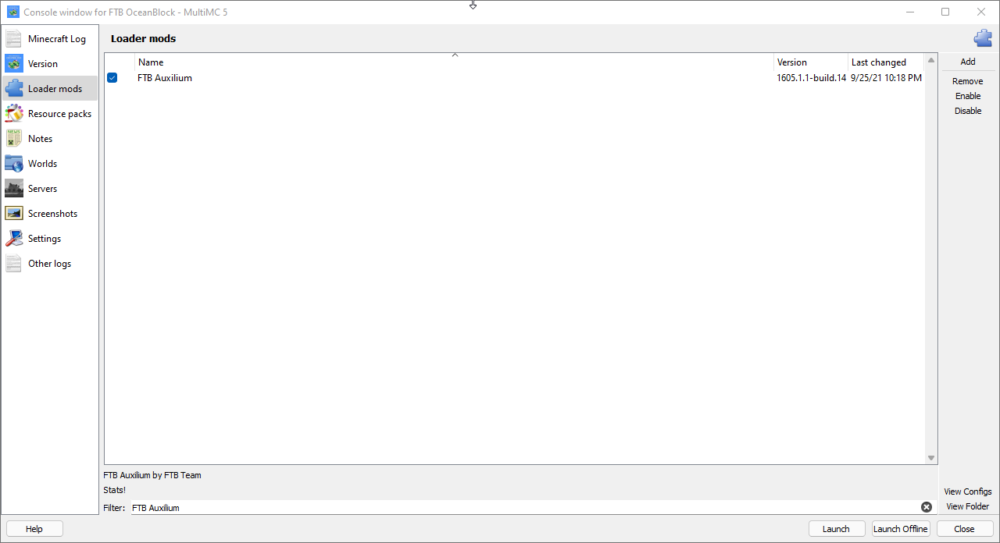

## Removing Unneeded Mods
There's often a few bundled mods in packs that simply add bloat, don't provide any functionality to the end user and in the end are simply unnecessary to play the pack.

{}
Removing Mods can sometimes cause pack instablity. Please consult your launcher on documentation on backing up your instance prior to preforming any of the tips below.
{}

#### MultiMC

Please follow the steps below when the game is not running.

1. Right Click on the instance and select `Edit Instance` from the menu that pops up.
2. On the left hand of the window you will see a list of icons and options. Click `Loader Mods`.
3. At the bottom of this new section there's a text box that is labeled filter type in  the name of the mod you wish to disable. For example to disable FTB Auxiium you would type `FTB Auxilium`. You should then see only one mod listed. Uncheck the check box for this mod.
4. Repeat for any other mods you neeed to remove then click "Close" when done.

Below is an example of what the MultiMC Loader Mods section looks like for FTB Auxilium.

 
### FTB Auxilium
All new FTB Packs seem to have this mod and we highly recommend you remove it because it sends computer and usage stats back to the FTB Team.