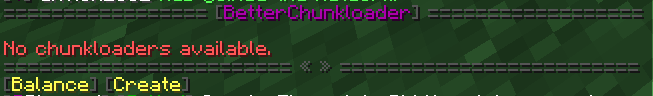
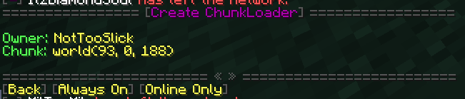
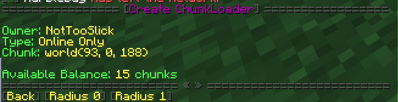
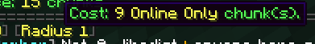
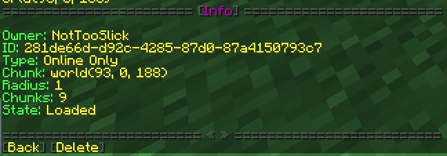
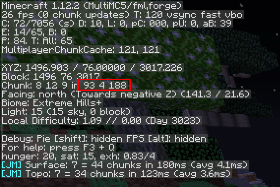
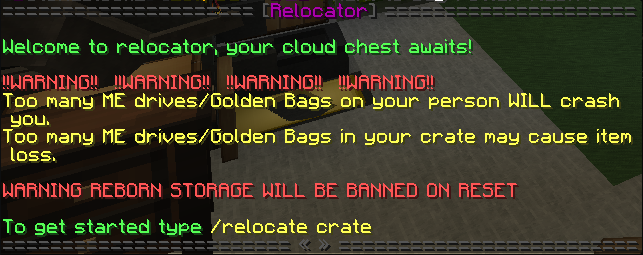

{}
- [Chunk Loaders](#Chunk-Loaders)
  - [Always Online vs Online Only](#Always-On-vs-Online-Only)
  - [Checking Your Balance](#Checking-Your-Balance)
  - [Creating a Chunk Loader](#How-to-Create-Chunk-Loaders)
  - [Viewing Active Chunk Loaders](#How-to-View-Active-Chunk-Loaders)
  - [Reading Chunk Coordinates](#How-to-Read-Chunk-Coordinates)
- [Claiming](#claiming)
  - [How to Claim](#how-to-claim)  
  - [2D vs 3D](#2d-vs-3d)
  - [How to Subdivide](#how-to-subdivide-claims)
- [Crates](#crates)
- [MultiMC](#multimc)
  - [How to Install](#how-to-install)
  - [Login to your Profile](#login-to-your-profile)
  - [Allocate More Ram](#allocate-more-ram)
  - [Setup an Instance](#setup-an-instance)
    - [With Link](#with-link)
    - [With ZIP](#with-zip)
  - [Archive Cannot Find instance.cfg](#archive-cannot-find-instance.cfg)
  - [Adding Java Arguments](#adding-java-arguments)
- [Summoning the Ender Dragon](#summoning-the-ender-dragon)
- [How to use Github Gist](#how-to-use-github-gist)
- [Offensive Skins](#offense-skins)
- [Relocation](#relocation)

{}

# Chunk Loaders
Modded Chunk Loaders have been disabled on ShadowNode servers globally, therefore we have added a plugin known as Better Chunk  Loaders to achieve their purpose. There are two types of Chunk Loaders, Always On and Online Only. To view chunk borders, hit ``F3+g``

The most basic command in the plugin is ``/betterchunkloader``, or just ``/bcl`` for short. Executing this command will open an interface in the chat that the user may interact with. The interface will contain a list of active chunk loaders you currently own, along with some user-friendly icons. An example of the interface is below.

### Always On vs Online Only
Always On is a chunk loader which is online 24/7 and will keep the chunk loaded. However, the chunk loader will stop loading the chunk after 3 days of activity. Once the owner returns, it will resume loading the chunk.The Online Only chunk loader will only load the chunk when the owner of the loader is online.

### Checking Your Balance
To check the number of chunks you may use/have used, you can click the ``Balance`` or run ``/bcl bal``. The interface will state the number of both Always Online and Online Only chunks that are currently active (used) and are available.

### How to Create Chunk Loaders
From the main interface, you should click the ``Create`` icon or run ``/bcl create`` to begin the process of creating a Chunk Loader. An interface will open and should look like the following image.

The interface will state the name of the chunk loader Owner. It will also give you the coordinates of the chunk that you are currently standing in. Please note that these coordinates are different than regular XYZ coordinates. To create an Always Online chunk loader or Online Only chunk loader, click their respective icons. You should be prompted with the following interface.

The ``Radius`` icons will determine the size of the chunk loader. You can only load as many chunks as your balance allows. Hovering over the icon will display how many chunks will be loaded with each radius upgrade.

After you select your radius size, your chunk loader will be created. You will be shown a confirmation window which will display your name, loader id, and state. If you'd like to delete your loader and regain your chunk balance, click the ``Delete`` icon.

## How to View Active Chunk Loaders
Once you have Chunk Loaders active, running ``/bcl`` will contain some information regarding regarding your active chunk loaders. You can hover over the ``Chunk`` icon to view the coordinates of the chunk loader. Clicking ``View`` will pull up the same prompt that was displayed after you created your loader originally.

## How to Read Chunk Coordinates
To view the coordinates of the chunk you are currently in, press ``F3``. You will see the typical statistics of your game, which should resemble the image below. The value in the red box is your chunk coordinates.

___

# Claiming
All of our servers use the latest Grief Prevention plugin for claiming.

## How to Claim
To claim you can either use a Golden Shovel you make, or one provide to you when you first join the server (some servers do not start with the golden shovel or have had their claim tool changed). Every block claimed is accounted for. You can buy claim blocks from the tokenshop, or from the store. Before claiming any land, please make sure to check which method of claiming you currently are using, [2D or 3D](#2D-vs-3D). Once your method of choice is confirmed, we can begin claiming. If you are in 2D mode, right click two opposite corners of the intended claim. For 3D mode, right click two opposite corners, one at the lowest point in the claim, and the other at the highest point in the claim. You can right click the air or ground with a stick to see who claims the block you are looking at.

### 2D vs 3D
2D means that no what Y level you claim the blocks on, Grief Prevention will make your claim from bedrock to make build level. 3D will require you to claim your area in a cube and will only claim what is inside the cube.

## How to Subdivide Claims
Subdividing your claim means making smaller sections in the bigger claim to allow people to build/access certain parts of your base. To subdivide claims, hold your golden shovel and run the command ``subdivideclaims``. This changes your golden shovel to create smaller claims. This is always in 2D mode, but it reaches to the highest level of your main claim. When you select two corners you see iron blocks instead of golden blocks. To get out of subdivideclaims mode, scroll your mouse wheel off the golden shovel and then back onto it. This can be used to make towns and/or sell plots to other players for in-game currency.

___

# Crates

We use a plugin called HuskyCrates to manage our crates. Crates contain items, the quality of which depends on the tier of the crate. To open a create you must hold the crate key in your hand and right click the corresponding crate. You can obtain crate keys by either purchasing them from our [store](https://shop.shadownode.ca), or buy buying them in our token shop. 
{}
Some items on this list may not be on your server as some modpacks don't have all the mods as others.
{}

| Mod | Common | Uncommon | Rare | Legendary | Exotic |
|:---:|:------:|:--------:|:----:|:---------:|:------:|
| Vanilla | Iron Blocks   Gold Blocks   Coal Blocks   Potatoes   Spider Eyes   Nether Warts   Ender Pearls   Bones   Melon Seeds   Leather Armor | Name Tag   Saddle   Redstone Blocks   Emerald Blocks   Iron Horse Armor   Blaze Powder   Golden Apple   Creeper Head   Skeleton Head   Zombie Head | Obsidian   Bookshelves   Ender Chestplate   Cake   Gold Horse Armor   Eyes of Ender   Ghast Tears   Wither Skeleton Head | Anvil   Sponge   Ghast Tears   Diamond Pickaxe   Diamond Shovel   Diamond Axe   Diamond Hoe   Prismarine Shard   Nether Quartz   Doomhammer Axe   Rotokiller Hoe   Mjolnir Pickaxe   The Infernian Shovel | Enchantment Table    Beacon   Nether Star   Diamond Horse Armor   Diamond Horse Armor   Enchanted Golden Apple   Chorus Fruit   Mirkwood Bow   Godkiller Sword | End Crystals   Dragon's Breath   Dragon Egg    Spawn Guardian Egg   Sponge   Block of Emerald   Bottles O' Enchanting   Elytra   HEV Helmet   HEV Chestplate   HEV Leggings   HEV Boots |
| Draconic Evolution | Generator    Draconium Nugget | Mob Grinder   Draconium Ingot | Wyvern Axe   Dislocator   Dislocator Pedestal   Infused Obsidian | Wyvern Pickaxe   Wyvern Sword   Draconic Core   Basic Energy Crystal   Crystal Binder Wrench | Wyvern Helmet    Wyvern Chestplate   Wyvern Leggings   Wyvern Boots   Wyvern Bow   Wyvern Shovel   Energy Core   Basic Fusion Crafter   Basic Wireless Crystal | Custom Named Draconic Tool   Wyvern Capacitor   Dragon Heart   Draconium Ingot   Wyvern Core   Wyvern Fusion Crafter   Energy Core Stablizers |
| Ender IO | Silicon   Basic Capacitor   Reservoir | Photovoltaic Cell   Sag Mill   Alloy Smelter   Stirling Generator   Powered Light | Energy Conduits    Item Conduits    Energetic Alloy   Experience Rod   Basic Capacitor Bank   Experience Obelisk   Item Filter | Enchanter   Vacuum Chestplate    XP Vacuum   Soul Binder   Slice 'n' Splice   Vibrant Alloy   Enhanced Energy Conduit | Farming Station    Filled Soul Vial   Dark Steel Helmet   Dark Steel Chestplate   Dark Steel Leggings   Dark Steel Boots   Travel Anchor   Advanced Filter   The Vat | Wireless Charger   Wither Proof Obsidian   Dark Steel   Ender Energy Conduit   Advanced Photovoltaic Cell |
| Immersive Engineering | Wooden Crate   Balloon   Kinetic Dynamo   Conveyer Belt    Industrial Hemp Seeds | Water Wheel   Wind Mill   LV Wire Coil   Engineers Skyhook   LV Wire Connector   LV Wire Relay   Treated Planks | MV Wire Coil   MV Wire Connector    MV Relay   Improved Windmill   Engineers Work Bench   Coke Brick   Blast Brick | Concrete   Floodlight | Revolver with Ammo | Rail Gun   Mining Drill   Chemthrower   Relic Shader Grab Bag |
| Botania | Lexica Botania    Black Lotus   Mana in a Bottle   Magnet Ring   Vanilla Seeds   Tiny Potato   Wand of the Forest | Living Wood   Living Rock   Mana Spreader   Mana Pool   Black Lotus   Petal Apothecary | Mana Steel   Manasteel Helmet   Manasteel Chestplate   Manasteel Leggings   Manasteel Boots   Endoflame   Clayconia   Agricarnaton   Hopperhock   Mana Diamond   Mana Pearl | Terrestrial Agglomeration Set   Horn of the Wold   Band of Aura   Band of Mana   Full Mana Tablet   Invisibility Cloak   Ring of Dexterous Motion   Base Runes   Endo Flame   Agricarnation | Sojourne Sash    Tier 2 Runes   Thermalilly   Terrasteel Helmet   Terrasteel Chestplate   Terrasteel Leggings   Third Eye   Terrasteel   Blaze Lamp   Alchemy Catalyst   Overgrowth Seed   Kekimurus | Alfheim Portal Core   Dreamwood   Elven Mana Spreader   Kekimurus   Loonium   Fallen Kanade   Elementium TOol   Gaia Spirits   Orechid |

___

# MultiMC
MultiMC is a Minecraft launcher. It can be used to launch vanilla Minecraft, custom modpacks, or regular modpacks. The launcher is very good for Linux users or those who don't like the Twitch Launcher. **We strongly recommend this launcher.**

## How to Install
1. Head to [MultiMC](https://multimc.org) and select which software is most appropriate for you.
2. Locate the downloaded zip file and export it into a folder.
  - On most machines, you can right click the folder, click export files and select your destination. If your machine does not have this option, head to Google!
3. Open the MultiMC folder generated at the location specified during export and double click the MultiMC executable.
4. Complete the final setup details that it asks for, such as your preferred language and java version.

## Login to your Profile
1. Click Profiles at the top
2. Click Manage Accounts in the dropdown
3. Click Add on the right side and fill out the request information

## Allocate More Ram
*This must be done before setting up an instance*
1. Click the settings, found at the top of your toolbar
2. Head to Java on the left side
3. Under the memory section you will be able to change your minimum and maximum allocation
  - We do not suggest going above 8192mb
  - 6144mb is the average selection for 1.12+

## Setup an Instance
### With Link
1. Copy the link address from the modpack download page
2. In MultiMC, select the white blank paper at the top that says Add Instance
3. Check the box next to Import Modpack (local file or link)
4. Paste your link into the text box below
5. Enter the name of the modpack
6. Click on the instance and launch

**To update you must reinstall the new update in the same manor as you downloaded the pack oringinally. Remember to save any world files for single player worlds.**
### With Zip
1. Download a zip file of the modpack from the modpack download page
2. In MultiMC, select the white blank paper at the top that says Add Instance
3. Check the box next to Import Modpack (local file or link)
4. Click the 3 dots and locate your zip
5. Once located, click ok
6. Launch and enjoy

## Archive Cannot find instance.cfg
Ensure that you are running a version higher than or equal to 0.6.0. You can find your version at the top of the launcher toolbar. If your version is not higher than or equal to 0.6.0, follow [this tutorial](https://github.com/MultiMC/MultiMC5/wiki/Switching-update-channels)

## Adding Java Arguments
1. Locate the Settings tab at the top of the toolbar
2. Click Java on the left side
3. Locate JVM Arguments in the Java Runtime section
4. Fill in your desired arguments in the blank
5. Click test to verify everything is working properly.

---

# Summoning the Ender Dragon

To summon the Ender Dragon, you will need 43 blocks of obsidian in your inventory and 4 end crystals. Simply go to The End, and run the command `/portalplace` with the required materials in your inventory. Once the structure is built, place the 4 end crystals on each side of the structure and the ender dragon should spawn!

---

# How to Use Github Gist
While other copy and paste tools, like Pastebin or Hastebin, are more popular then Github Gist, Github Gist is one of the better copy and paste tools. It doesn't have a character count and it's just as easy to use as other tools. Using a copy and paste tool like Gist is recommended if you have issues with client crashes since it keeps the formatting of the log, and makes it easier to read the file without having to download it. 

1. Use [this](https://gist.github.com/) link.
2. Give the gist a title in the small "filename" window above the large text window.
3. Open the file you wish to share.
4. Use Ctrl+A to select the whole text and Ctrl+C to copy it.
5. Go on the Gist Page and use Ctrl+V to paste it in the large text window.
6. Click on "Create Secret Gist". The file you have may not be that important, but it's not necessary to share it with the whole world.
7. Copy the link from the gist website, and paste it anywhere you'd like!

---

# Offensive Skins
If you're reading this, there's a good chance that you've been hit with a ban that says "Your skin is offensive, please change it". You forgot to change your Hitler skin when you were trolling, don't worry! Even though you've quickly changed it, you still lost valuable playing time. 

Don't want that to happen to you? Just do one quick thing: Check your skin! If you haven't changed it in a while, it might be good to take a quick look in game by using F5 or a site like [NameMC](https://namemc.com).

If you've been banned, don't worry! Just create a ban appeal in the proper section of Discord and give us your username. Once staff verifies that your skin is no longer against our rules, you'll be unbanned!

#### What qualifies as bad
 1. Anything relating to Nazi's or Communists
 2. Nudity - visible genitals of any kind
 
 ---
 
 # Relocation
 Crate relocation is a method that we have created in order to compensate for wiping servers. it will hold a **limited** number of items for you to be able to access them later. 
 
 #### Conditions to be capable of relocating
 1. Must be across servers wit the same mod pack, such as Stoneblock A to Stoneblock B
 2. May also be used to store some items to use after a map wipe
 3. **Cannot** be across different mod packs, such as Skyfactory to Beyond
 
If you run ``/relocate`` a message in chat will be triggered to warn you of a few common issues:
 1. It will warn you that if your player has a large number of items such as a full ME drive or a full bag, it **will crash** your game and you **may loose** the item/context of the items if the crash is not fixed. 
    1. *Anything with a sub-inventory (such as armor with a modifier) has a risk of being lost. To prevent this, please put them in the crate separately.*
2. If a certain mod/item has plans to be banned/removed from the pack there will be a warning.
    1. The purpose of this warning is for you to **NOT** include them in your crate because you **WILL** lose them.

If you run ``/relocate crate`` an inventory similar to a chest will appear on your screen. You may drag items that you wish to save into the chest. *The chest does not save the order in which you place the items.* You may run the command again to open this inventory to take items out of it or to add more. In order to access the items after the wipe, or on the other server, run ``/relocate crate``

{}
There will be a deadline to when you can access your relocate crate. This applies to both adding items, and removing items. If you are relocating after a reset and you fail to take your items out of the crate in time, they will be removed. The deadline will be posted in the Discord server. 
{}

#### Items Inserted

#### Crate Reopened

